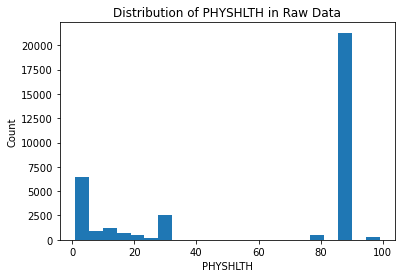

# Hypothesis Testing - Cumulative Lab

## Introduction

In this cumulative lab, you will use pandas to clean up a dataset and perform some EDA, then perform statistical tests and interpret their results in order to answer some business questions.

## Objectives

You will be able to:

* Practice using a data dictionary
* Practice using pandas to prepare data for statistical analysis
* Practice identifying an appropriate statistical test for a given question
* Practice defining the null and alternative hypotheses
* Practice executing statistical tests and interpreting their results

## Your Task: Analyzing Health Trends


Photo by <a href="https://unsplash.com/@kellysikkema?utm_source=unsplash&utm_medium=referral&utm_content=creditCopyText">Kelly Sikkema</a> on <a href="/?utm_source=unsplash&utm_medium=referral&utm_content=creditCopyText">Unsplash</a>

### Business Understanding

Flatiron Health Insurance (FHI) is a growing private healthcare insurance provider founded on the premise that using data and analytics can improve the health insurance industry by providing better care and offerings to its patients. Every year, the Center for Disease Control (CDC) conducts surveys to understand the latest demographic, health, and fitness trends. You have been tasked with analyzing the recently published results of the 2017-2018 survey and providing your recommendations back to the Chief Analytics Officer and Chief Marketing Officer. You have been assigned the task of taking a first look at the data and beginning to answer several key questions:
											 								
1. How does health status, represented by average number of days with bad physical health in the past month (`PHYSHLTH`), differ by state?					 								
2. Digging deeper into the data, what are some factors that impact health (demographics, behaviors, etc.)?	

### Data Understanding

To get you started, the IT department formatted the data set into a tab delimited text file for only NY, NJ, and CT (FHI’s primary markets) called `case_study.csv`.

There is also a PDF data dictionary called `data_dictionary.pdf`, which explains the meanings of the features and codes contained in this dataset.

Both files are located in the `data/` directory of this repository.

Prior to each statistical test, you will need to perform some data preparation, which could include:

* Filtering out rows with irrelevant values
* Transforming data from codes into human-readable values
* Binning data to transform it from numeric to categorical
* Creating new columns based on queries of the values in other columns

For steps 2-5, you will need to select and execute an appropriate statistical test. Recall these tests we have learned so far:

1. [Chi-squared test](https://docs.scipy.org/doc/scipy/reference/generated/scipy.stats.chi2_contingency.html): used for comparing a categorical feature against a categorical feature, to determine whether they are independent
2. [t-test](https://docs.scipy.org/doc/scipy/reference/generated/scipy.stats.ttest_ind.html): used for comparing two categories of a numeric feature, to determine whether their means are the same across categories
3. [ANOVA](https://www.statsmodels.org/stable/generated/statsmodels.stats.anova.anova_lm.html#statsmodels.stats.anova.anova_lm): used for comparing more than two categories of a numeric feature, to determine whether their means are the same across categories

### Requirements

#### 1. Prepare `PHYSHLTH` Data for Analysis

Using the data dictionary, ensure that you understand the meaning of the `PHYSHLTH` column. Then clean the data so that only valid records of `PHYSHLTH` remain.

#### 2. Describe the Distribution of Health Status by State

Does health status (`PHYSHLTH`) differ by state (`STATE_`)? If so, by how much, and is it statistically significant?

#### 3. Describe the Relationship between Health Status and Home Ownership Status

Does health status (`PHYSHLTH`) differ between home owners and renters (`RENTHOM1`)? If so, by how much, and is it statistically significant?

#### 4. Describe the Relationship between Chronic Sickness and Nicotine Use

Does chronic sickness (`PHYSHLTH >= 15`) differ based on nicotine use (various columns)? If so, by how much, and is it statistically significant?

#### 5. Choose Your Own Question

Thinking about the business case, what is another question that might be useful to answer? Perform all analysis steps to answer this question.

## 1. Prepare `PHYSHLTH` Data for Analysis

In the cells below, we include the relevant imports and load the data into a dataframe called `df`:


```python
import pandas as pd
import matplotlib.pyplot as plt
import numpy as np
%matplotlib inline
```


```python
df = pd.read_csv("data/case_study.csv", index_col=0, low_memory=False)
df
```


<div>
<style scoped>
    .dataframe tbody tr th:only-of-type {
        vertical-align: middle;
    }

    .dataframe tbody tr th {
        vertical-align: top;
    }

    .dataframe thead th {
        text-align: right;
    }
</style>
<table border="1" class="dataframe">
  <thead>
    <tr style="text-align: right;">
      <th></th>
      <th>_STATE</th>
      <th>FMONTH</th>
      <th>IDATE</th>
      <th>IMONTH</th>
      <th>IDAY</th>
      <th>IYEAR</th>
      <th>DISPCODE</th>
      <th>SEQNO</th>
      <th>_PSU</th>
      <th>CTELENM1</th>
      <th>...</th>
      <th>_PA300R2</th>
      <th>_PA30021</th>
      <th>_PASTRNG</th>
      <th>_PAREC1</th>
      <th>_PASTAE1</th>
      <th>_RFSEAT2</th>
      <th>_RFSEAT3</th>
      <th>_FLSHOT6</th>
      <th>_PNEUMO2</th>
      <th>_AIDTST3</th>
    </tr>
  </thead>
  <tbody>
    <tr>
      <th>49938</th>
      <td>9.0</td>
      <td>5.0</td>
      <td>5172017</td>
      <td>5</td>
      <td>17</td>
      <td>2017</td>
      <td>1200.0</td>
      <td>2017000001</td>
      <td>2.017000e+09</td>
      <td>NaN</td>
      <td>...</td>
      <td>2.0</td>
      <td>2.0</td>
      <td>2.0</td>
      <td>4.0</td>
      <td>2.0</td>
      <td>1.0</td>
      <td>1.0</td>
      <td>NaN</td>
      <td>NaN</td>
      <td>1.0</td>
    </tr>
    <tr>
      <th>49939</th>
      <td>9.0</td>
      <td>2.0</td>
      <td>2142017</td>
      <td>2</td>
      <td>14</td>
      <td>2017</td>
      <td>1200.0</td>
      <td>2017000002</td>
      <td>2.017000e+09</td>
      <td>NaN</td>
      <td>...</td>
      <td>1.0</td>
      <td>1.0</td>
      <td>1.0</td>
      <td>1.0</td>
      <td>1.0</td>
      <td>2.0</td>
      <td>2.0</td>
      <td>NaN</td>
      <td>NaN</td>
      <td>2.0</td>
    </tr>
    <tr>
      <th>49940</th>
      <td>9.0</td>
      <td>1.0</td>
      <td>1292017</td>
      <td>1</td>
      <td>29</td>
      <td>2017</td>
      <td>1200.0</td>
      <td>2017000003</td>
      <td>2.017000e+09</td>
      <td>NaN</td>
      <td>...</td>
      <td>3.0</td>
      <td>2.0</td>
      <td>1.0</td>
      <td>3.0</td>
      <td>2.0</td>
      <td>1.0</td>
      <td>1.0</td>
      <td>NaN</td>
      <td>NaN</td>
      <td>2.0</td>
    </tr>
    <tr>
      <th>49941</th>
      <td>9.0</td>
      <td>7.0</td>
      <td>9112017</td>
      <td>9</td>
      <td>11</td>
      <td>2017</td>
      <td>1200.0</td>
      <td>2017000004</td>
      <td>2.017000e+09</td>
      <td>NaN</td>
      <td>...</td>
      <td>2.0</td>
      <td>2.0</td>
      <td>2.0</td>
      <td>2.0</td>
      <td>2.0</td>
      <td>1.0</td>
      <td>1.0</td>
      <td>NaN</td>
      <td>NaN</td>
      <td>1.0</td>
    </tr>
    <tr>
      <th>49942</th>
      <td>9.0</td>
      <td>5.0</td>
      <td>7182017</td>
      <td>7</td>
      <td>18</td>
      <td>2017</td>
      <td>1200.0</td>
      <td>2017000005</td>
      <td>2.017000e+09</td>
      <td>NaN</td>
      <td>...</td>
      <td>2.0</td>
      <td>2.0</td>
      <td>1.0</td>
      <td>1.0</td>
      <td>1.0</td>
      <td>1.0</td>
      <td>1.0</td>
      <td>NaN</td>
      <td>NaN</td>
      <td>2.0</td>
    </tr>
    <tr>
      <th>...</th>
      <td>...</td>
      <td>...</td>
      <td>...</td>
      <td>...</td>
      <td>...</td>
      <td>...</td>
      <td>...</td>
      <td>...</td>
      <td>...</td>
      <td>...</td>
      <td>...</td>
      <td>...</td>
      <td>...</td>
      <td>...</td>
      <td>...</td>
      <td>...</td>
      <td>...</td>
      <td>...</td>
      <td>...</td>
      <td>...</td>
      <td>...</td>
    </tr>
    <tr>
      <th>303774</th>
      <td>36.0</td>
      <td>5.0</td>
      <td>5152017</td>
      <td>5</td>
      <td>15</td>
      <td>2017</td>
      <td>1200.0</td>
      <td>2017012245</td>
      <td>2.017012e+09</td>
      <td>NaN</td>
      <td>...</td>
      <td>3.0</td>
      <td>2.0</td>
      <td>2.0</td>
      <td>4.0</td>
      <td>2.0</td>
      <td>1.0</td>
      <td>1.0</td>
      <td>NaN</td>
      <td>NaN</td>
      <td>1.0</td>
    </tr>
    <tr>
      <th>303775</th>
      <td>36.0</td>
      <td>6.0</td>
      <td>6252017</td>
      <td>6</td>
      <td>25</td>
      <td>2017</td>
      <td>1200.0</td>
      <td>2017012246</td>
      <td>2.017012e+09</td>
      <td>NaN</td>
      <td>...</td>
      <td>2.0</td>
      <td>2.0</td>
      <td>2.0</td>
      <td>4.0</td>
      <td>2.0</td>
      <td>1.0</td>
      <td>1.0</td>
      <td>NaN</td>
      <td>NaN</td>
      <td>1.0</td>
    </tr>
    <tr>
      <th>303776</th>
      <td>36.0</td>
      <td>7.0</td>
      <td>7212017</td>
      <td>7</td>
      <td>21</td>
      <td>2017</td>
      <td>1200.0</td>
      <td>2017012247</td>
      <td>2.017012e+09</td>
      <td>NaN</td>
      <td>...</td>
      <td>2.0</td>
      <td>2.0</td>
      <td>2.0</td>
      <td>4.0</td>
      <td>2.0</td>
      <td>1.0</td>
      <td>1.0</td>
      <td>NaN</td>
      <td>NaN</td>
      <td>1.0</td>
    </tr>
    <tr>
      <th>303777</th>
      <td>36.0</td>
      <td>7.0</td>
      <td>7202017</td>
      <td>7</td>
      <td>20</td>
      <td>2017</td>
      <td>1200.0</td>
      <td>2017012248</td>
      <td>2.017012e+09</td>
      <td>NaN</td>
      <td>...</td>
      <td>9.0</td>
      <td>9.0</td>
      <td>9.0</td>
      <td>9.0</td>
      <td>9.0</td>
      <td>9.0</td>
      <td>9.0</td>
      <td>9.0</td>
      <td>9.0</td>
      <td>9.0</td>
    </tr>
    <tr>
      <th>303778</th>
      <td>36.0</td>
      <td>7.0</td>
      <td>7252017</td>
      <td>7</td>
      <td>25</td>
      <td>2017</td>
      <td>1200.0</td>
      <td>2017012249</td>
      <td>2.017012e+09</td>
      <td>NaN</td>
      <td>...</td>
      <td>3.0</td>
      <td>2.0</td>
      <td>2.0</td>
      <td>4.0</td>
      <td>2.0</td>
      <td>1.0</td>
      <td>1.0</td>
      <td>NaN</td>
      <td>NaN</td>
      <td>1.0</td>
    </tr>
  </tbody>
</table>
<p>34545 rows × 358 columns</p>
</div>


Our main column of interest is called `PHYSHLTH`. We display summary statistics and plot a distribution below:


```python
df['PHYSHLTH'].describe()
```


    count    34545.000000
    mean        60.213403
    std         37.504566
    min          1.000000
    25%         15.000000
    50%         88.000000
    75%         88.000000
    max         99.000000
    Name: PHYSHLTH, dtype: float64


```python
fig, ax = plt.subplots()
ax.hist(df["PHYSHLTH"], bins="auto")
ax.set_xlabel("PHYSHLTH")
ax.set_ylabel("Count")
ax.set_title("Distribution of PHYSHLTH in Raw Data");
```





This feature is supposed to represent the number of days with bad physical health out of the past 30 days. Do you see anything wrong with what is displayed above? Explain.


```python
"""
If these values represent a number of days out of the past 30 days,
we would expect the lowest number to be 0 and the highest number to
be 30. Instead we have many numbers in the 70s-90s range, so much so
that our mean is an impossible number, higher than 30
"""
```

Look in the data dictionary, page 17, to understand what is happening with these values. Then edit the cell below so:

* The records where the `PHYSHLTH` value label is `None` are converted to 0
* The records where the `PHYSHLTH` value label is `Number of days` are kept as-is
* All other records are dropped (i.e. records with `Don't know/Not sure`, `Refused`, and `Not asked or Missing` value labels for `PHYSHLTH` are dropped)


```python

# Code 88 means None, replace it with 0
df.loc[df["PHYSHLTH"]==88, "PHYSHLTH"] = 0

# Now, only keep records where PHYSHLTH is <= 30
# (making a copy to avoid future SettingWithCopyWarning messages)
df = df[df["PHYSHLTH"] <= 30].copy()

df
```


<div>
<style scoped>
    .dataframe tbody tr th:only-of-type {
        vertical-align: middle;
    }

    .dataframe tbody tr th {
        vertical-align: top;
    }

    .dataframe thead th {
        text-align: right;
    }
</style>
<table border="1" class="dataframe">
  <thead>
    <tr style="text-align: right;">
      <th></th>
      <th>_STATE</th>
      <th>FMONTH</th>
      <th>IDATE</th>
      <th>IMONTH</th>
      <th>IDAY</th>
      <th>IYEAR</th>
      <th>DISPCODE</th>
      <th>SEQNO</th>
      <th>_PSU</th>
      <th>CTELENM1</th>
      <th>...</th>
      <th>_PA300R2</th>
      <th>_PA30021</th>
      <th>_PASTRNG</th>
      <th>_PAREC1</th>
      <th>_PASTAE1</th>
      <th>_RFSEAT2</th>
      <th>_RFSEAT3</th>
      <th>_FLSHOT6</th>
      <th>_PNEUMO2</th>
      <th>_AIDTST3</th>
    </tr>
  </thead>
  <tbody>
    <tr>
      <th>49938</th>
      <td>9.0</td>
      <td>5.0</td>
      <td>5172017</td>
      <td>5</td>
      <td>17</td>
      <td>2017</td>
      <td>1200.0</td>
      <td>2017000001</td>
      <td>2.017000e+09</td>
      <td>NaN</td>
      <td>...</td>
      <td>2.0</td>
      <td>2.0</td>
      <td>2.0</td>
      <td>4.0</td>
      <td>2.0</td>
      <td>1.0</td>
      <td>1.0</td>
      <td>NaN</td>
      <td>NaN</td>
      <td>1.0</td>
    </tr>
    <tr>
      <th>49939</th>
      <td>9.0</td>
      <td>2.0</td>
      <td>2142017</td>
      <td>2</td>
      <td>14</td>
      <td>2017</td>
      <td>1200.0</td>
      <td>2017000002</td>
      <td>2.017000e+09</td>
      <td>NaN</td>
      <td>...</td>
      <td>1.0</td>
      <td>1.0</td>
      <td>1.0</td>
      <td>1.0</td>
      <td>1.0</td>
      <td>2.0</td>
      <td>2.0</td>
      <td>NaN</td>
      <td>NaN</td>
      <td>2.0</td>
    </tr>
    <tr>
      <th>49940</th>
      <td>9.0</td>
      <td>1.0</td>
      <td>1292017</td>
      <td>1</td>
      <td>29</td>
      <td>2017</td>
      <td>1200.0</td>
      <td>2017000003</td>
      <td>2.017000e+09</td>
      <td>NaN</td>
      <td>...</td>
      <td>3.0</td>
      <td>2.0</td>
      <td>1.0</td>
      <td>3.0</td>
      <td>2.0</td>
      <td>1.0</td>
      <td>1.0</td>
      <td>NaN</td>
      <td>NaN</td>
      <td>2.0</td>
    </tr>
    <tr>
      <th>49941</th>
      <td>9.0</td>
      <td>7.0</td>
      <td>9112017</td>
      <td>9</td>
      <td>11</td>
      <td>2017</td>
      <td>1200.0</td>
      <td>2017000004</td>
      <td>2.017000e+09</td>
      <td>NaN</td>
      <td>...</td>
      <td>2.0</td>
      <td>2.0</td>
      <td>2.0</td>
      <td>2.0</td>
      <td>2.0</td>
      <td>1.0</td>
      <td>1.0</td>
      <td>NaN</td>
      <td>NaN</td>
      <td>1.0</td>
    </tr>
    <tr>
      <th>49942</th>
      <td>9.0</td>
      <td>5.0</td>
      <td>7182017</td>
      <td>7</td>
      <td>18</td>
      <td>2017</td>
      <td>1200.0</td>
      <td>2017000005</td>
      <td>2.017000e+09</td>
      <td>NaN</td>
      <td>...</td>
      <td>2.0</td>
      <td>2.0</td>
      <td>1.0</td>
      <td>1.0</td>
      <td>1.0</td>
      <td>1.0</td>
      <td>1.0</td>
      <td>NaN</td>
      <td>NaN</td>
      <td>2.0</td>
    </tr>
    <tr>
      <th>...</th>
      <td>...</td>
      <td>...</td>
      <td>...</td>
      <td>...</td>
      <td>...</td>
      <td>...</td>
      <td>...</td>
      <td>...</td>
      <td>...</td>
      <td>...</td>
      <td>...</td>
      <td>...</td>
      <td>...</td>
      <td>...</td>
      <td>...</td>
      <td>...</td>
      <td>...</td>
      <td>...</td>
      <td>...</td>
      <td>...</td>
      <td>...</td>
    </tr>
    <tr>
      <th>303774</th>
      <td>36.0</td>
      <td>5.0</td>
      <td>5152017</td>
      <td>5</td>
      <td>15</td>
      <td>2017</td>
      <td>1200.0</td>
      <td>2017012245</td>
      <td>2.017012e+09</td>
      <td>NaN</td>
      <td>...</td>
      <td>3.0</td>
      <td>2.0</td>
      <td>2.0</td>
      <td>4.0</td>
      <td>2.0</td>
      <td>1.0</td>
      <td>1.0</td>
      <td>NaN</td>
      <td>NaN</td>
      <td>1.0</td>
    </tr>
    <tr>
      <th>303775</th>
      <td>36.0</td>
      <td>6.0</td>
      <td>6252017</td>
      <td>6</td>
      <td>25</td>
      <td>2017</td>
      <td>1200.0</td>
      <td>2017012246</td>
      <td>2.017012e+09</td>
      <td>NaN</td>
      <td>...</td>
      <td>2.0</td>
      <td>2.0</td>
      <td>2.0</td>
      <td>4.0</td>
      <td>2.0</td>
      <td>1.0</td>
      <td>1.0</td>
      <td>NaN</td>
      <td>NaN</td>
      <td>1.0</td>
    </tr>
    <tr>
      <th>303776</th>
      <td>36.0</td>
      <td>7.0</td>
      <td>7212017</td>
      <td>7</td>
      <td>21</td>
      <td>2017</td>
      <td>1200.0</td>
      <td>2017012247</td>
      <td>2.017012e+09</td>
      <td>NaN</td>
      <td>...</td>
      <td>2.0</td>
      <td>2.0</td>
      <td>2.0</td>
      <td>4.0</td>
      <td>2.0</td>
      <td>1.0</td>
      <td>1.0</td>
      <td>NaN</td>
      <td>NaN</td>
      <td>1.0</td>
    </tr>
    <tr>
      <th>303777</th>
      <td>36.0</td>
      <td>7.0</td>
      <td>7202017</td>
      <td>7</td>
      <td>20</td>
      <td>2017</td>
      <td>1200.0</td>
      <td>2017012248</td>
      <td>2.017012e+09</td>
      <td>NaN</td>
      <td>...</td>
      <td>9.0</td>
      <td>9.0</td>
      <td>9.0</td>
      <td>9.0</td>
      <td>9.0</td>
      <td>9.0</td>
      <td>9.0</td>
      <td>9.0</td>
      <td>9.0</td>
      <td>9.0</td>
    </tr>
    <tr>
      <th>303778</th>
      <td>36.0</td>
      <td>7.0</td>
      <td>7252017</td>
      <td>7</td>
      <td>25</td>
      <td>2017</td>
      <td>1200.0</td>
      <td>2017012249</td>
      <td>2.017012e+09</td>
      <td>NaN</td>
      <td>...</td>
      <td>3.0</td>
      <td>2.0</td>
      <td>2.0</td>
      <td>4.0</td>
      <td>2.0</td>
      <td>1.0</td>
      <td>1.0</td>
      <td>NaN</td>
      <td>NaN</td>
      <td>1.0</td>
    </tr>
  </tbody>
</table>
<p>33747 rows × 358 columns</p>
</div>


Run the code below to ensure you have the correct, cleaned dataframe:


```python

# We should have fewer rows, the same number of columns
assert df.shape == (33747, 358)

# The maximum value in this column should now be 30
assert df["PHYSHLTH"].max() == 30.0
```

Now we can look at the same descriptive information on our cleaned data:


```python
df['PHYSHLTH'].describe()
```


    count    33747.000000
    mean         4.085341
    std          8.513293
    min          0.000000
    25%          0.000000
    50%          0.000000
    75%          3.000000
    max         30.000000
    Name: PHYSHLTH, dtype: float64


```python
fig, ax = plt.subplots()
ax.hist(df["PHYSHLTH"])
ax.set_xlabel("PHYSHLTH")
ax.set_ylabel("Count")
ax.set_title("Distribution of PHYSHLTH in Cleaned Data");
```


That looks a lot more reasonable. Let's move on to the next step.

## 2. Describe the Distribution of Health Status by State

As mentioned previously, this dataset only includes data from three states.


```python
df["_STATE"].value_counts()
```


    36.0    11876
    34.0    11458
    9.0     10413
    Name: _STATE, dtype: int64


Look in the data dictionary, pages 2-3, to determine which states map onto which codes. Then replace the numbers with strings representing the state names.


```python
df["_STATE"].replace({36: "New York", 34: "New Jersey", 9: "Connecticut"}, inplace=True)
df
```


<div>
<style scoped>
    .dataframe tbody tr th:only-of-type {
        vertical-align: middle;
    }

    .dataframe tbody tr th {
        vertical-align: top;
    }

    .dataframe thead th {
        text-align: right;
    }
</style>
<table border="1" class="dataframe">
  <thead>
    <tr style="text-align: right;">
      <th></th>
      <th>_STATE</th>
      <th>FMONTH</th>
      <th>IDATE</th>
      <th>IMONTH</th>
      <th>IDAY</th>
      <th>IYEAR</th>
      <th>DISPCODE</th>
      <th>SEQNO</th>
      <th>_PSU</th>
      <th>CTELENM1</th>
      <th>...</th>
      <th>_PA300R2</th>
      <th>_PA30021</th>
      <th>_PASTRNG</th>
      <th>_PAREC1</th>
      <th>_PASTAE1</th>
      <th>_RFSEAT2</th>
      <th>_RFSEAT3</th>
      <th>_FLSHOT6</th>
      <th>_PNEUMO2</th>
      <th>_AIDTST3</th>
    </tr>
  </thead>
  <tbody>
    <tr>
      <th>49938</th>
      <td>Connecticut</td>
      <td>5.0</td>
      <td>5172017</td>
      <td>5</td>
      <td>17</td>
      <td>2017</td>
      <td>1200.0</td>
      <td>2017000001</td>
      <td>2.017000e+09</td>
      <td>NaN</td>
      <td>...</td>
      <td>2.0</td>
      <td>2.0</td>
      <td>2.0</td>
      <td>4.0</td>
      <td>2.0</td>
      <td>1.0</td>
      <td>1.0</td>
      <td>NaN</td>
      <td>NaN</td>
      <td>1.0</td>
    </tr>
    <tr>
      <th>49939</th>
      <td>Connecticut</td>
      <td>2.0</td>
      <td>2142017</td>
      <td>2</td>
      <td>14</td>
      <td>2017</td>
      <td>1200.0</td>
      <td>2017000002</td>
      <td>2.017000e+09</td>
      <td>NaN</td>
      <td>...</td>
      <td>1.0</td>
      <td>1.0</td>
      <td>1.0</td>
      <td>1.0</td>
      <td>1.0</td>
      <td>2.0</td>
      <td>2.0</td>
      <td>NaN</td>
      <td>NaN</td>
      <td>2.0</td>
    </tr>
    <tr>
      <th>49940</th>
      <td>Connecticut</td>
      <td>1.0</td>
      <td>1292017</td>
      <td>1</td>
      <td>29</td>
      <td>2017</td>
      <td>1200.0</td>
      <td>2017000003</td>
      <td>2.017000e+09</td>
      <td>NaN</td>
      <td>...</td>
      <td>3.0</td>
      <td>2.0</td>
      <td>1.0</td>
      <td>3.0</td>
      <td>2.0</td>
      <td>1.0</td>
      <td>1.0</td>
      <td>NaN</td>
      <td>NaN</td>
      <td>2.0</td>
    </tr>
    <tr>
      <th>49941</th>
      <td>Connecticut</td>
      <td>7.0</td>
      <td>9112017</td>
      <td>9</td>
      <td>11</td>
      <td>2017</td>
      <td>1200.0</td>
      <td>2017000004</td>
      <td>2.017000e+09</td>
      <td>NaN</td>
      <td>...</td>
      <td>2.0</td>
      <td>2.0</td>
      <td>2.0</td>
      <td>2.0</td>
      <td>2.0</td>
      <td>1.0</td>
      <td>1.0</td>
      <td>NaN</td>
      <td>NaN</td>
      <td>1.0</td>
    </tr>
    <tr>
      <th>49942</th>
      <td>Connecticut</td>
      <td>5.0</td>
      <td>7182017</td>
      <td>7</td>
      <td>18</td>
      <td>2017</td>
      <td>1200.0</td>
      <td>2017000005</td>
      <td>2.017000e+09</td>
      <td>NaN</td>
      <td>...</td>
      <td>2.0</td>
      <td>2.0</td>
      <td>1.0</td>
      <td>1.0</td>
      <td>1.0</td>
      <td>1.0</td>
      <td>1.0</td>
      <td>NaN</td>
      <td>NaN</td>
      <td>2.0</td>
    </tr>
    <tr>
      <th>...</th>
      <td>...</td>
      <td>...</td>
      <td>...</td>
      <td>...</td>
      <td>...</td>
      <td>...</td>
      <td>...</td>
      <td>...</td>
      <td>...</td>
      <td>...</td>
      <td>...</td>
      <td>...</td>
      <td>...</td>
      <td>...</td>
      <td>...</td>
      <td>...</td>
      <td>...</td>
      <td>...</td>
      <td>...</td>
      <td>...</td>
      <td>...</td>
    </tr>
    <tr>
      <th>303774</th>
      <td>New York</td>
      <td>5.0</td>
      <td>5152017</td>
      <td>5</td>
      <td>15</td>
      <td>2017</td>
      <td>1200.0</td>
      <td>2017012245</td>
      <td>2.017012e+09</td>
      <td>NaN</td>
      <td>...</td>
      <td>3.0</td>
      <td>2.0</td>
      <td>2.0</td>
      <td>4.0</td>
      <td>2.0</td>
      <td>1.0</td>
      <td>1.0</td>
      <td>NaN</td>
      <td>NaN</td>
      <td>1.0</td>
    </tr>
    <tr>
      <th>303775</th>
      <td>New York</td>
      <td>6.0</td>
      <td>6252017</td>
      <td>6</td>
      <td>25</td>
      <td>2017</td>
      <td>1200.0</td>
      <td>2017012246</td>
      <td>2.017012e+09</td>
      <td>NaN</td>
      <td>...</td>
      <td>2.0</td>
      <td>2.0</td>
      <td>2.0</td>
      <td>4.0</td>
      <td>2.0</td>
      <td>1.0</td>
      <td>1.0</td>
      <td>NaN</td>
      <td>NaN</td>
      <td>1.0</td>
    </tr>
    <tr>
      <th>303776</th>
      <td>New York</td>
      <td>7.0</td>
      <td>7212017</td>
      <td>7</td>
      <td>21</td>
      <td>2017</td>
      <td>1200.0</td>
      <td>2017012247</td>
      <td>2.017012e+09</td>
      <td>NaN</td>
      <td>...</td>
      <td>2.0</td>
      <td>2.0</td>
      <td>2.0</td>
      <td>4.0</td>
      <td>2.0</td>
      <td>1.0</td>
      <td>1.0</td>
      <td>NaN</td>
      <td>NaN</td>
      <td>1.0</td>
    </tr>
    <tr>
      <th>303777</th>
      <td>New York</td>
      <td>7.0</td>
      <td>7202017</td>
      <td>7</td>
      <td>20</td>
      <td>2017</td>
      <td>1200.0</td>
      <td>2017012248</td>
      <td>2.017012e+09</td>
      <td>NaN</td>
      <td>...</td>
      <td>9.0</td>
      <td>9.0</td>
      <td>9.0</td>
      <td>9.0</td>
      <td>9.0</td>
      <td>9.0</td>
      <td>9.0</td>
      <td>9.0</td>
      <td>9.0</td>
      <td>9.0</td>
    </tr>
    <tr>
      <th>303778</th>
      <td>New York</td>
      <td>7.0</td>
      <td>7252017</td>
      <td>7</td>
      <td>25</td>
      <td>2017</td>
      <td>1200.0</td>
      <td>2017012249</td>
      <td>2.017012e+09</td>
      <td>NaN</td>
      <td>...</td>
      <td>3.0</td>
      <td>2.0</td>
      <td>2.0</td>
      <td>4.0</td>
      <td>2.0</td>
      <td>1.0</td>
      <td>1.0</td>
      <td>NaN</td>
      <td>NaN</td>
      <td>1.0</td>
    </tr>
  </tbody>
</table>
<p>33747 rows × 358 columns</p>
</div>


Below, we check the values:


```python

# Shape should be the same
assert df.shape == (33747, 358)

# Values in state column should be changed
assert sorted(list(df["_STATE"].value_counts().index)) == ['Connecticut', 'New Jersey', 'New York']
```


```python

ny = df.loc[df["_STATE"] == "New York", "PHYSHLTH"]
nj = df.loc[df["_STATE"] == "New Jersey", "PHYSHLTH"]
ct = df.loc[df["_STATE"] == "Connecticut", "PHYSHLTH"]

fig, ax = plt.subplots(figsize=(15, 6))

ax.hist(
    x=[ny, nj, ct],
    label=["New York", "New Jersey", "Connecticut"],
    bins=range(32),
    align="left"
)

ax.set_xlabel("PHYSHLTH")
ax.set_ylabel("Count")
ax.set_title("Distribution of PHYSHLTH by State")

ax.legend(title="State");
```


Looking at the plot above, does the distribution seem to differ by state?

(Just answer based on a visual inspection; we will do the statistical assessment next.)


```python
"""
Not really, the states all seem to have approximately the same
distribution of unhealthy days
"""
```

For the statistical test, we will be comparing the *means* of `PHYSHLTH` across states, as a representation of the overall distribution. In other words, when operationalizing the question **does `PHYSHLTH` differ by state?** we want to answer that in terms of the mean `PHYSHLTH`.

Let's look at those means:


```python
df.groupby("_STATE")["PHYSHLTH"].mean()
```


    _STATE
    Connecticut    3.688562
    New Jersey     4.380957
    New York       4.148030
    Name: PHYSHLTH, dtype: float64


You likely noted that the overall distribution looked about the same, but these means are different. We have a range from Connecticut with about 3.7 days of bad health to New Jersey with about 4.4 days. But is that difference statistically significant?

Identify which of the statistical tests you have learned is the most appropriate for this question, and why. Make sure you mention what kinds of variables are being compared (numeric and categorical), and how many categories there are.


```python
"""
ANOVA is the most appropriate technique since we are trying to determine
whether there is a difference in PHYSHLTH (a numeric feature) across 3
categories. If we only had 2 categories, a t-test would be appropriate,
but we want to use ANOVA because there are 3
"""
```

Now, identify the null and alternative hypotheses:


```python
"""
Null hypothesis: the means of PHYSHLTH are the same across states

Alternative hypothesis: the means of PHYSHLTH are not the same across states
"""
```

In the cell below, we set up and execute the statistical test for you. If this doesn't match your previous answer about which test to perform, look at the solution branch to understand why this is the appropriate test.


```python
import statsmodels.api as sm
from statsmodels.formula.api import ols

formula = 'PHYSHLTH ~ C(_STATE)'
lm = ols(formula, df).fit()
sm.stats.anova_lm(lm)
```


<div>
<style scoped>
    .dataframe tbody tr th:only-of-type {
        vertical-align: middle;
    }

    .dataframe tbody tr th {
        vertical-align: top;
    }

    .dataframe thead th {
        text-align: right;
    }
</style>
<table border="1" class="dataframe">
  <thead>
    <tr style="text-align: right;">
      <th></th>
      <th>df</th>
      <th>sum_sq</th>
      <th>mean_sq</th>
      <th>F</th>
      <th>PR(&gt;F)</th>
    </tr>
  </thead>
  <tbody>
    <tr>
      <th>C(_STATE)</th>
      <td>2.0</td>
      <td>2.687322e+03</td>
      <td>1343.660882</td>
      <td>18.558645</td>
      <td>8.800607e-09</td>
    </tr>
    <tr>
      <th>Residual</th>
      <td>33744.0</td>
      <td>2.443093e+06</td>
      <td>72.400809</td>
      <td>NaN</td>
      <td>NaN</td>
    </tr>
  </tbody>
</table>
</div>


Interpret the results of this statistical test below. What is the calculated p-value? Were we able to reject the null hypothesis at an alpha of 0.05? What does this say about how `PHYSHLTH` varies by state? What recommendations would you make to the business?


```python
"""
Yes, we were able to reject the null hypothesis. The p-value,
identified here as PR(>F) for the _STATE category, is much
smaller than 0.05.

This means that even though the overall distribution seemed
similar across states, and the means are all around 3-4 days
per month, with this sample size we can say that there is a 
statistically significant difference between them.

Based on this information, we might recommend to the business
that they investigate further why people in Connecticut have
the best health and why people in New Jersey have the worst
health out of these states.
"""
```

With that section wrapped up, let's move on to the next step.

## 3. Describe the Relationship between Health Status and Home Ownership Status

This time, we want to categorize respondents by demographic information: specifically, we'll look at whether or not they own their home.

Once again, this will require some data preparation. The variable of interest is contained in the `RENTHOM1` column. Currently the values look like this:


```python
df["RENTHOM1"].value_counts()
```


    1.0    21690
    2.0    10244
    3.0     1526
    9.0      194
    7.0       93
    Name: RENTHOM1, dtype: int64


In the cell below, modify `df` so that we have dropped all records where the `RENTHOM1` value label is neither `Own` nor `Rent`, and we have replaced the numeric codes with `Own` and `Rent` respectively. You can find more information about codes on page 33 of the data dictionary.


```python

# Replace codes with labels
df["RENTHOM1"].replace({1: "Own", 2: "Rent"}, inplace=True)

# Only keep records with those labels
df = df[df["RENTHOM1"].isin(["Own", "Rent"])].copy()

df
```


<div>
<style scoped>
    .dataframe tbody tr th:only-of-type {
        vertical-align: middle;
    }

    .dataframe tbody tr th {
        vertical-align: top;
    }

    .dataframe thead th {
        text-align: right;
    }
</style>
<table border="1" class="dataframe">
  <thead>
    <tr style="text-align: right;">
      <th></th>
      <th>_STATE</th>
      <th>FMONTH</th>
      <th>IDATE</th>
      <th>IMONTH</th>
      <th>IDAY</th>
      <th>IYEAR</th>
      <th>DISPCODE</th>
      <th>SEQNO</th>
      <th>_PSU</th>
      <th>CTELENM1</th>
      <th>...</th>
      <th>_PA300R2</th>
      <th>_PA30021</th>
      <th>_PASTRNG</th>
      <th>_PAREC1</th>
      <th>_PASTAE1</th>
      <th>_RFSEAT2</th>
      <th>_RFSEAT3</th>
      <th>_FLSHOT6</th>
      <th>_PNEUMO2</th>
      <th>_AIDTST3</th>
    </tr>
  </thead>
  <tbody>
    <tr>
      <th>49938</th>
      <td>Connecticut</td>
      <td>5.0</td>
      <td>5172017</td>
      <td>5</td>
      <td>17</td>
      <td>2017</td>
      <td>1200.0</td>
      <td>2017000001</td>
      <td>2.017000e+09</td>
      <td>NaN</td>
      <td>...</td>
      <td>2.0</td>
      <td>2.0</td>
      <td>2.0</td>
      <td>4.0</td>
      <td>2.0</td>
      <td>1.0</td>
      <td>1.0</td>
      <td>NaN</td>
      <td>NaN</td>
      <td>1.0</td>
    </tr>
    <tr>
      <th>49939</th>
      <td>Connecticut</td>
      <td>2.0</td>
      <td>2142017</td>
      <td>2</td>
      <td>14</td>
      <td>2017</td>
      <td>1200.0</td>
      <td>2017000002</td>
      <td>2.017000e+09</td>
      <td>NaN</td>
      <td>...</td>
      <td>1.0</td>
      <td>1.0</td>
      <td>1.0</td>
      <td>1.0</td>
      <td>1.0</td>
      <td>2.0</td>
      <td>2.0</td>
      <td>NaN</td>
      <td>NaN</td>
      <td>2.0</td>
    </tr>
    <tr>
      <th>49940</th>
      <td>Connecticut</td>
      <td>1.0</td>
      <td>1292017</td>
      <td>1</td>
      <td>29</td>
      <td>2017</td>
      <td>1200.0</td>
      <td>2017000003</td>
      <td>2.017000e+09</td>
      <td>NaN</td>
      <td>...</td>
      <td>3.0</td>
      <td>2.0</td>
      <td>1.0</td>
      <td>3.0</td>
      <td>2.0</td>
      <td>1.0</td>
      <td>1.0</td>
      <td>NaN</td>
      <td>NaN</td>
      <td>2.0</td>
    </tr>
    <tr>
      <th>49941</th>
      <td>Connecticut</td>
      <td>7.0</td>
      <td>9112017</td>
      <td>9</td>
      <td>11</td>
      <td>2017</td>
      <td>1200.0</td>
      <td>2017000004</td>
      <td>2.017000e+09</td>
      <td>NaN</td>
      <td>...</td>
      <td>2.0</td>
      <td>2.0</td>
      <td>2.0</td>
      <td>2.0</td>
      <td>2.0</td>
      <td>1.0</td>
      <td>1.0</td>
      <td>NaN</td>
      <td>NaN</td>
      <td>1.0</td>
    </tr>
    <tr>
      <th>49942</th>
      <td>Connecticut</td>
      <td>5.0</td>
      <td>7182017</td>
      <td>7</td>
      <td>18</td>
      <td>2017</td>
      <td>1200.0</td>
      <td>2017000005</td>
      <td>2.017000e+09</td>
      <td>NaN</td>
      <td>...</td>
      <td>2.0</td>
      <td>2.0</td>
      <td>1.0</td>
      <td>1.0</td>
      <td>1.0</td>
      <td>1.0</td>
      <td>1.0</td>
      <td>NaN</td>
      <td>NaN</td>
      <td>2.0</td>
    </tr>
    <tr>
      <th>...</th>
      <td>...</td>
      <td>...</td>
      <td>...</td>
      <td>...</td>
      <td>...</td>
      <td>...</td>
      <td>...</td>
      <td>...</td>
      <td>...</td>
      <td>...</td>
      <td>...</td>
      <td>...</td>
      <td>...</td>
      <td>...</td>
      <td>...</td>
      <td>...</td>
      <td>...</td>
      <td>...</td>
      <td>...</td>
      <td>...</td>
      <td>...</td>
    </tr>
    <tr>
      <th>303773</th>
      <td>New York</td>
      <td>4.0</td>
      <td>4212017</td>
      <td>4</td>
      <td>21</td>
      <td>2017</td>
      <td>1200.0</td>
      <td>2017012244</td>
      <td>2.017012e+09</td>
      <td>NaN</td>
      <td>...</td>
      <td>3.0</td>
      <td>2.0</td>
      <td>2.0</td>
      <td>4.0</td>
      <td>2.0</td>
      <td>1.0</td>
      <td>1.0</td>
      <td>NaN</td>
      <td>NaN</td>
      <td>1.0</td>
    </tr>
    <tr>
      <th>303774</th>
      <td>New York</td>
      <td>5.0</td>
      <td>5152017</td>
      <td>5</td>
      <td>15</td>
      <td>2017</td>
      <td>1200.0</td>
      <td>2017012245</td>
      <td>2.017012e+09</td>
      <td>NaN</td>
      <td>...</td>
      <td>3.0</td>
      <td>2.0</td>
      <td>2.0</td>
      <td>4.0</td>
      <td>2.0</td>
      <td>1.0</td>
      <td>1.0</td>
      <td>NaN</td>
      <td>NaN</td>
      <td>1.0</td>
    </tr>
    <tr>
      <th>303775</th>
      <td>New York</td>
      <td>6.0</td>
      <td>6252017</td>
      <td>6</td>
      <td>25</td>
      <td>2017</td>
      <td>1200.0</td>
      <td>2017012246</td>
      <td>2.017012e+09</td>
      <td>NaN</td>
      <td>...</td>
      <td>2.0</td>
      <td>2.0</td>
      <td>2.0</td>
      <td>4.0</td>
      <td>2.0</td>
      <td>1.0</td>
      <td>1.0</td>
      <td>NaN</td>
      <td>NaN</td>
      <td>1.0</td>
    </tr>
    <tr>
      <th>303776</th>
      <td>New York</td>
      <td>7.0</td>
      <td>7212017</td>
      <td>7</td>
      <td>21</td>
      <td>2017</td>
      <td>1200.0</td>
      <td>2017012247</td>
      <td>2.017012e+09</td>
      <td>NaN</td>
      <td>...</td>
      <td>2.0</td>
      <td>2.0</td>
      <td>2.0</td>
      <td>4.0</td>
      <td>2.0</td>
      <td>1.0</td>
      <td>1.0</td>
      <td>NaN</td>
      <td>NaN</td>
      <td>1.0</td>
    </tr>
    <tr>
      <th>303778</th>
      <td>New York</td>
      <td>7.0</td>
      <td>7252017</td>
      <td>7</td>
      <td>25</td>
      <td>2017</td>
      <td>1200.0</td>
      <td>2017012249</td>
      <td>2.017012e+09</td>
      <td>NaN</td>
      <td>...</td>
      <td>3.0</td>
      <td>2.0</td>
      <td>2.0</td>
      <td>4.0</td>
      <td>2.0</td>
      <td>1.0</td>
      <td>1.0</td>
      <td>NaN</td>
      <td>NaN</td>
      <td>1.0</td>
    </tr>
  </tbody>
</table>
<p>31934 rows × 358 columns</p>
</div>


```python
df["RENTHOM1"].value_counts()
```


    Own     21690
    Rent    10244
    Name: RENTHOM1, dtype: int64


Below, we check that this was done correctly:


```python

# Number of rows should be smaller again
assert df.shape == (31934, 358)

# Only two values should be present in this column
assert sorted(list(df["RENTHOM1"].value_counts().index)) == ['Own', 'Rent']
```

Now, similar to the previous step, create a plot that shows the distribution of `PHYSHLTH` for those who own vs. rent their homes, including appropriate axis labels and legend. Because there is more of an imbalance of categories this time (more than twice as many owners as renters, compared to nearly-even numbers from New York, New Jersey, and Connecticut), make sure you add the argument `density=True`, so that the y-axis shows the density (proportion) rather than the count.


```python

own = df.loc[df["RENTHOM1"] == "Own", "PHYSHLTH"]
rent = df.loc[df["RENTHOM1"] == "Rent", "PHYSHLTH"]

fig, ax = plt.subplots(figsize=(15, 6))

ax.hist(
    x=[own, rent],
    label=["Own", "Rent"],
    bins=range(32),
    align="left",
    density=True
)

ax.set_xlabel("PHYSHLTH")
ax.set_ylabel("Proportion")
ax.set_title("Distribution of PHYSHLTH by Home Ownership")

ax.legend(title="Own or Rent Home");
```


Then run this code to find the averages:


```python
df.groupby("RENTHOM1")["PHYSHLTH"].mean()
```


    RENTHOM1
    Own     3.531213
    Rent    5.197970
    Name: PHYSHLTH, dtype: float64


Now, interpret the plot and averages. Does it seem like there a difference in the number of unhealthy days between those who rent their homes and those who own their homes? How does this compare to the distributions by state?


```python
"""
While the overall distribution is fairly similar again, there is
a clearer difference between renters and owners. Home owners are
more likely to report 0 unhealthy days than renters are, whereas
renters are more likely to report all other numbers of unhealthy
days.

The difference in means is also larger: about 3.5 vs. about 5.2
unhealthy days per month.
"""
```

Now, choose and execute an appropriate statistical test. Make sure you describe why you chose the test, the null and alternative hypotheses, and what the result of the test means.


```python

"""
Here we choose a t-test since we are comparing a numeric feature
(PHYSHLTH) vs. a categorical feature (RENTHOM1), and the categorical
feature contains only two categories.

Null hypothesis: there is no difference in mean unhealthy days per
month between homeowners and renters

Alternative hypothesis: renters have more mean unhealthy days per
month than homeowners

Because we set the alternative hypothesis to be "more" and not just
that the means are not the same, this is a one-tailed t-test and we
need to divide the result of the t-test from SciPy in half
"""

import scipy.stats as stats

ttest_pvalue = stats.ttest_ind(rent, own, equal_var=False).pvalue / 2
print("t-statistic p-value:", ttest_pvalue)
```

    t-statistic p-value: 5.394649320817826e-54


```python
"""
That p-value is much smaller than 0.05, so we are able to reject the
null hypothesis. This supports the conclusion that renters have
more mean unhealthy days per month than homeowners.

Potentially we could investigate whether this is mainly related to the
amount of money that people have (assuming that owners have more than
renters) or whether there is something inherently unhealthy about
renting (e.g. potentially landlords not repairing things) in order to
determine next steps.
"""
```

## 4. Describe the Relationship between Chronic Sickness and Nicotine Use

Once again, this will require some preparation before we can run the statistical test. Create a new column `NICOTINE_USE` with 1 representing someone who uses or has used nicotine in some form, and 0 representing someone who hasn't.

We define nicotine use as:

* Answered `Yes` to the `SMOKE100` question (*Have you smoked at least 100 cigarettes in your entire life?*, page 43), OR
* Answered `Every day` or `Some days` to the `USENOW3` question (*Do you currently use chewing tobacco, snuff, or snus every day, some days, or not at all?*, page 46), OR
* Answered `Yes` to the `ECIGARET` question (*Have you ever used an e-cigarette or other electronic vaping product, even just one time, in your entire life?*, page 46)

If a record matches one or more of the above criteria, `NICOTINE_USE` should be 1. Otherwise, `NICOTINE_USE` should be 0. Go ahead and keep all of the "Don't know" or "Refused" answers as 0.


```python

# Set everything to 0 initially
df["NICOTINE_USE"] = 0

# Make a mask to select the relevant values
# (this separate variable is not necessary
# but helps with readability)
mask = (
    # Has smoked at least 100 cigarettes
    (df["SMOKE100"] == 1) |
    # Uses chewing tobacco/snuff/snus every day or some days
    (df["USENOW3"] == 1) |
    (df["USENOW3"] == 2) |
    # Has smoked an e-cigarette
    (df["ECIGARET"] == 1)
)

# Set values to 1 where the mask condition is true
df.loc[mask, "NICOTINE_USE"] = 1

# Look at the distribution of values
df["NICOTINE_USE"].value_counts(normalize=True)
```


    0    0.563036
    1    0.436964
    Name: NICOTINE_USE, dtype: float64


This time, let's treat health status as a categorical variable. We'll say that a "chronically sick" person is a person who reports that their physical health was not good for 15 or more out of the past 30 days. (This is a simplification but it will work for this analysis.)

In the cell below, create a new column of `df` called `CHRONIC`, which is 0 for records where `PHYSHLTH` is less than 15, and 1 for records where `PHYSHLTH` is 15 or more.


```python
df["CHRONIC"] = (df["PHYSHLTH"] >= 15).apply(int)

# Alternatives:

# Helper function:
# def is_chronic(record):
#     if record["PHYSHLTH"] >= 15:
#         return 1
#     else:
#         return 0
# df["CHRONIC"] = df.apply(is_chronic, axis=1)

# NumPy:
# df["CHRONIC"] = np.where(df["PHYSHLTH"] >= 15, 1, 0)

# View the distribution of the newly-created column
df["CHRONIC"].value_counts()
```


    0    28246
    1     3688
    Name: CHRONIC, dtype: int64


Now we can view the crosstabs for these two categorical variables, as well as display their distributions:


```python
contingency_table = pd.crosstab(index=df["CHRONIC"], columns=df["NICOTINE_USE"])
contingency_table
```


<div>
<style scoped>
    .dataframe tbody tr th:only-of-type {
        vertical-align: middle;
    }

    .dataframe tbody tr th {
        vertical-align: top;
    }

    .dataframe thead th {
        text-align: right;
    }
</style>
<table border="1" class="dataframe">
  <thead>
    <tr style="text-align: right;">
      <th>NICOTINE_USE</th>
      <th>0</th>
      <th>1</th>
    </tr>
    <tr>
      <th>CHRONIC</th>
      <th></th>
      <th></th>
    </tr>
  </thead>
  <tbody>
    <tr>
      <th>0</th>
      <td>16332</td>
      <td>11914</td>
    </tr>
    <tr>
      <th>1</th>
      <td>1648</td>
      <td>2040</td>
    </tr>
  </tbody>
</table>
</div>


```python
no_nicotine_use = df.loc[df["NICOTINE_USE"] == 0, "CHRONIC"]
nicotine_use = df.loc[df["NICOTINE_USE"] == 1, "CHRONIC"]

fig, ax = plt.subplots()

ax.hist(
    x=[no_nicotine_use, nicotine_use],
    label=["No Nicotine Use", "Nicotine Use"],
    bins=[0,1,2],
    align="left"
)

ax.set_ylabel("Count")
ax.set_xticks([0,1])
ax.set_xticklabels(["Not Chronically Sick", "Chronically Sick"])
ax.set_title("Distribution of Chronic Sickness by Nicotine Use")

ax.legend();
```


Once again, it appears that there is a difference in health outcomes between these categories. In the cell below, select an appropriate statistical test, describe the null and alternative hypotheses, execute the test, and interpret the result.


```python

"""
Here we are comparing two categorical features, each with two
categories. A chi-squared test is appropriate for this, since
it compares proportions to expected proportions.

Null hypothesis: chronic sickness and nicotine use are 
independent, i.e. that the proportion of people reporting
chronic sickness does not differ based on whether or not
the person has used nicotine

Alternative hypothesis: chronic sickness and nicotine use are
not independent
"""

# Reusing the contingency_table created above
chi2, p, dof, expected = stats.chi2_contingency(contingency_table)

print("chi-squared p-value:", p)

results_table = pd.concat([pd.DataFrame(expected), contingency_table])
results_table.columns.name = "NICOTINE_USE"

results_table.index = ["0 (expected)", "1 (expected)", "0 (actual)", "1 (actual)"]
results_table.index.name = "CHRONIC"
results_table
```

    chi-squared p-value: 1.4525226945056695e-51


<div>
<style scoped>
    .dataframe tbody tr th:only-of-type {
        vertical-align: middle;
    }

    .dataframe tbody tr th {
        vertical-align: top;
    }

    .dataframe thead th {
        text-align: right;
    }
</style>
<table border="1" class="dataframe">
  <thead>
    <tr style="text-align: right;">
      <th>NICOTINE_USE</th>
      <th>0</th>
      <th>1</th>
    </tr>
    <tr>
      <th>CHRONIC</th>
      <th></th>
      <th></th>
    </tr>
  </thead>
  <tbody>
    <tr>
      <th>0 (expected)</th>
      <td>15903.522265</td>
      <td>12342.477735</td>
    </tr>
    <tr>
      <th>1 (expected)</th>
      <td>2076.477735</td>
      <td>1611.522265</td>
    </tr>
    <tr>
      <th>0 (actual)</th>
      <td>16332.000000</td>
      <td>11914.000000</td>
    </tr>
    <tr>
      <th>1 (actual)</th>
      <td>1648.000000</td>
      <td>2040.000000</td>
    </tr>
  </tbody>
</table>
</div>


```python

"""
Interpreting the result above, we can reject the null hypothesis
because we have a p-value much smaller than 0.05. In other words,
this finding is consistent with a statistically significant
relationship between nicotine use and incidence of chronic
sickness.

We can interpret the results table like this:

If nicotine use made no difference in chronic sickness, we would
expect to see about 2076 people who did not use nicotine and had
chronic sickness, and about 1611 people who did use nicotine and
had chronic sickness. The first category is larger because over
half (~56%) of people stated no nicotine use.

Instead what we found was that 1648 people who did not use
nicotine and had chronic sickness, and 2040 people who did use
nicotine and had chronic sickness. Thus even though people who
used nicotine formed the smaller group, they represented the 
majority of those with chronic sickness.

Of course, this does not prove a causal link. It is possible that
people who were already experiencing a large number of unhealthy
days actually started using nicotine to treat their symptoms. But
this seems to demonstrate that there is an important link between
nicotine use and not only long-term health issues, but also
short-term health status within the past 30 days.
"""
```

## 5. Choose Your Own Question

Now that you have investigated physical health and chronic sickness and their relationships with state, home ownership, and nicotine use, you will conduct a similar investigation with variables of your choosing.

Select an independent variable based on looking at the information in the data dictionary, and perform any additional transformations needed to use it in an analysis. Then set up, execute, and interpret a statistical test that addresses the relationship between that independent variable and `PHYSHLTH`.

(There is no solution branch for this question, and feel free to move on if you have already spent more than 1.5 hours on this lab.)

## Conclusion

Congratulations, another cumulative lab down! In this lab you practiced reading a data dictionary, performing various data transformations with pandas, and executing statistical tests to address business questions.
